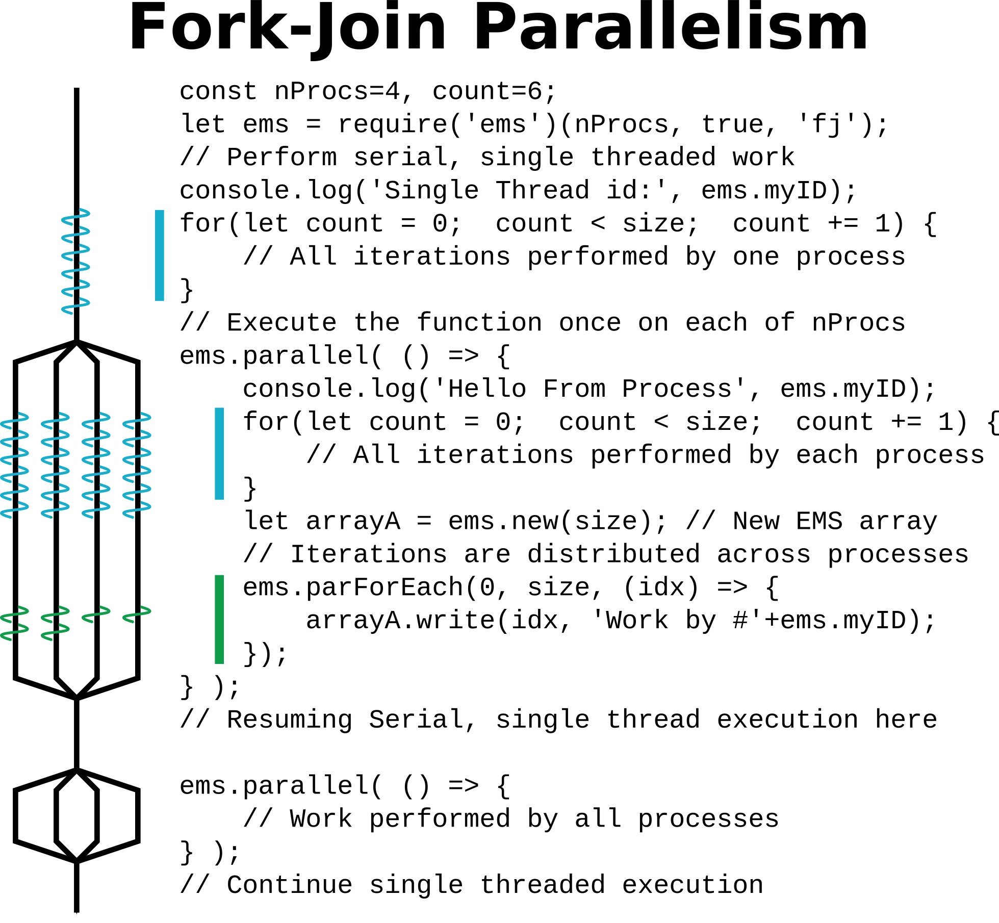

# EMS.js STREAMS Bandwidth Benchmark

The original [STREAMS](https://www.cs.virginia.edu/stream/)
benchmark measures the _Speed Not To Exceed_ 
bandwidth of a CPU to it's attached RAM by performing large
numbers of simple operations.  This version for
EMS<nolink>.js measures the rate of different atomic operations on
shared integer data and is implemented using two different parallelization schemes:
Bulk Synchronous Parallel (BSP), and Fork-Join.


## Parallel Execution Models

The EMS.js STREAMS benchmark is implemented twice, once using Bulk Synchronous Parallelism 
and again using Fork-Join parallelism.  

BSP goes parallel at program startup,
decomposes loop iterations across processes, and performs a barrier at the end
of each loop.  FJ starts serial and goes parallel for each loop, joining back
to serial execution before the next loop.

<table>
<tr>
<td width="50%">
<center>

</center>

</td>
<td width="50%">
<center>

</td>
</tr>
</table>


## Running the Benchmark

To run either version of STREAMS benchmark, specify the number of processes
as an argument to the program:

```bash
node streams_bulk_sync_parallel.js 8
```

Running the BSP version of the STREAMS benchmark reports the rate at
which each loop is performed, each loop exercising a single
EMS read and write primitive.
A second set of "Native" loops performs similar operations on ordinary
volatile private memory, taking advantage of all possible native
optimizations and just-in-time compilation.
These results show a performance difference of 20-50x 
accessing EMS memory versus native memory,
which is still very favorable compared to the 1000-5000x difference accessing
a remote key-value store, or worse accessing magnetic media.


```bash
dunlin> time node streams_bulk_sync_parallel.js 3
EMStask 0:       1,000,000 write         6,896,551 ops/sec
EMStask 0:       1,000,000 writeXE       7,246,376 ops/sec
EMStask 0:       1,000,000 writeXF       7,246,376 ops/sec
EMStask 0:       1,000,000 read          7,042,253 ops/sec
EMStask 0:       1,000,000 reread        6,896,551 ops/sec
EMStask 0:       1,000,000 readFF        7,299,270 ops/sec
EMStask 0:       1,000,000 readFE        7,194,244 ops/sec
EMStask 0:       1,000,000 writeEF       7,299,270 ops/sec
EMStask 0:       1,000,000 copy          3,521,126 ops/sec
EMStask 0:       1,000,000 recopy        3,484,320 ops/sec
EMStask 0:       1,000,000 c=a*b         2,364,066 ops/sec
EMStask 0:       1,000,000 c+=a*b        1,715,265 ops/sec
EMStask 0:       1,000,000 checksum        Infinity ops/sec
------------------------ START NATIVE ARRAY
EMStask 0:       1,000,000 write       333,333,333 ops/sec
EMStask 0:       1,000,000 rd/write    250,000,000 ops/sec
EMStask 0:       1,000,000 read        125,000,000 ops/sec
EMStask 0:       1,000,000 reread      250,000,000 ops/sec
EMStask 0:       1,000,000 copy        200,000,000 ops/sec
EMStask 0:       1,000,000 rmwcopy     250,000,000 ops/sec
EMStask 0:       1,000,000 c=a*b       100,000,000 ops/sec
EMStask 0:       1,000,000 c+=a*b      142,857,142 ops/sec
EMStask 0:       1,000,000 sum        Infinity ops/sec

real	0m2.938s
user	0m8.190s
sys	0m0.172s
```

__NOTE:__ Adding timing instrumentation to the Fork-Join version is
left as an exercise to the reader. 


## Benchmark Results
Benchmark results for the BSP implementation on an AWS
`c4.8xlarge (132 ECUs, 36 vCPUs, 2.9 GHz, Intel Xeon E5-2666v3, 60 GiB memory`.

<center>
</center>

